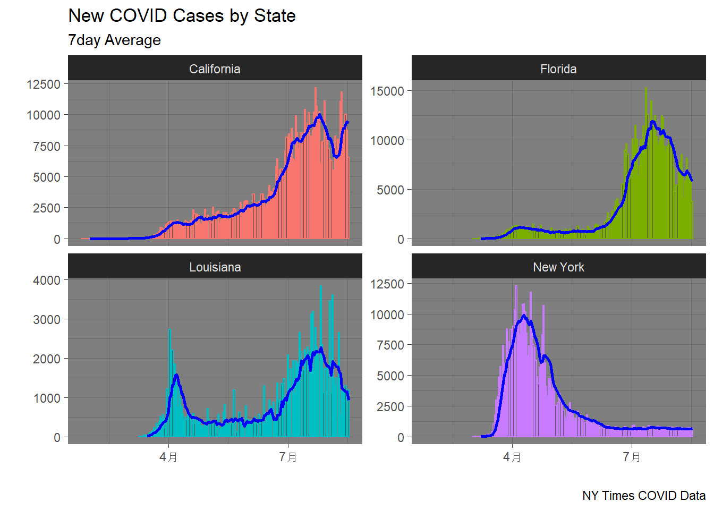
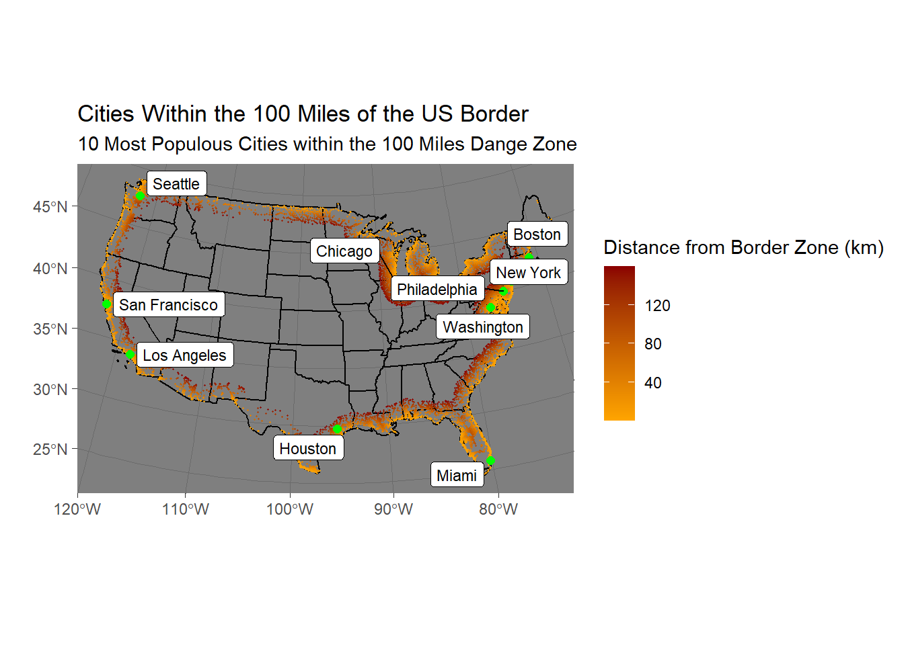
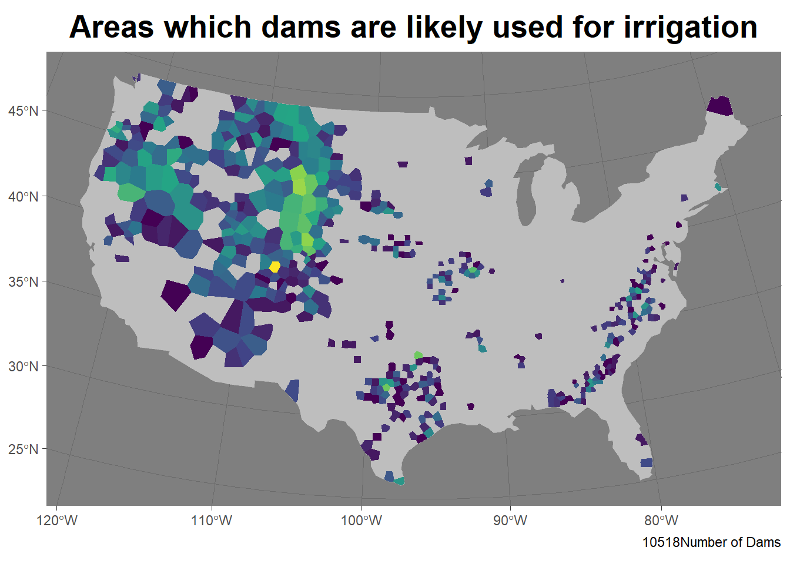
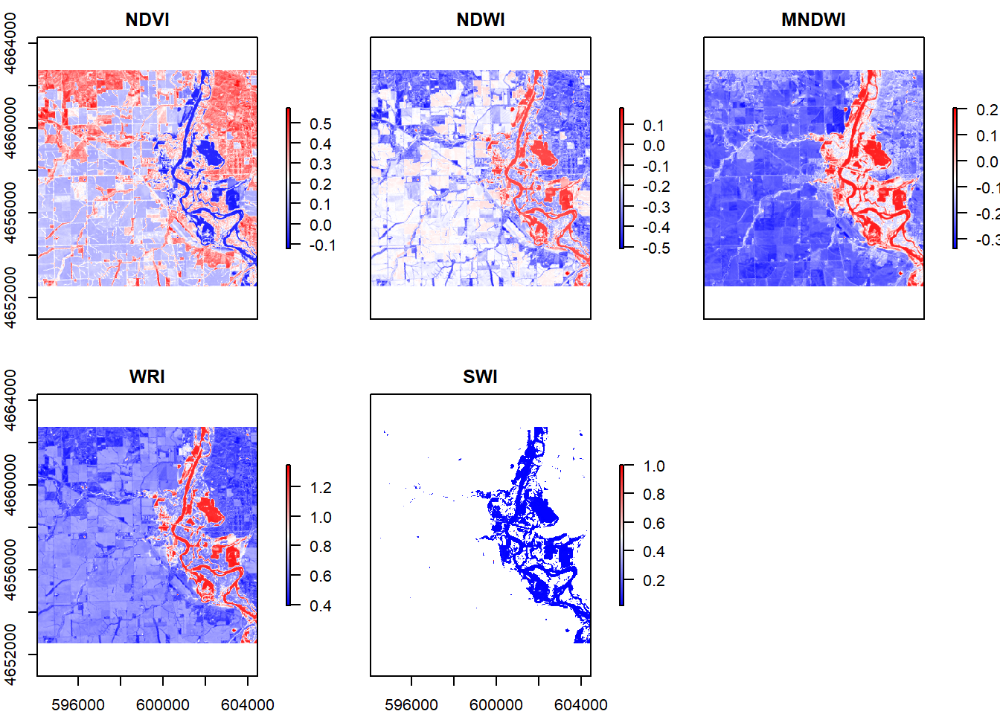
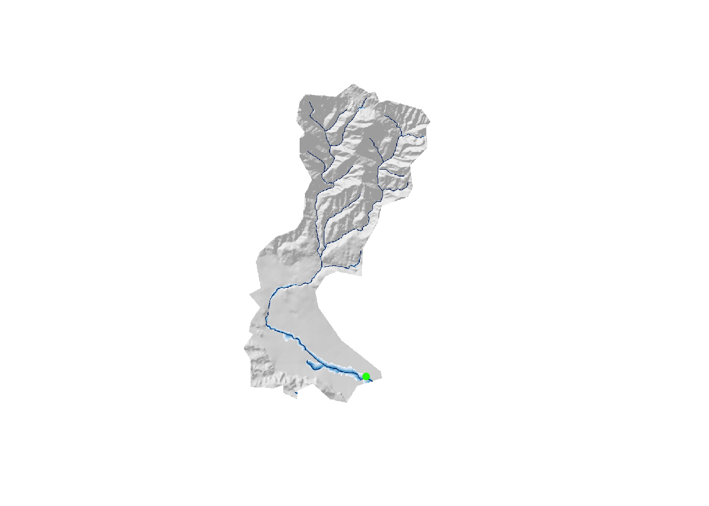

In the summer session B of 2020 I took a class GIS course, GEOG 176A, based in R. I wrote some code, and did some cool data science. Here is a collection of links! 

<i class="fas fa-link fa-2x" style="color:navy;"></i>

### [LAB 1:Building a project website](index.html)

- I built my own webpage in this project with Rmarkdown and Rstudio.
- In this assignment we built a static users site with Github Pages 
- Includes a github repo and repository for access to all the code in my project.
- Get familiar with Rstudio and Github.
- A good startup of GIS upper division courses

### [LAB 2:COVID-19 Cases Data Wrangling](https://mycraysh.github.io/geog-176A-labs/lab-02.html)

- I used the knitr command to create the table
- Also used ggplot command to visualize my data
- I learned how to complete dataframe manipulation and joining datasets.

{width="75%"}

### [LAB 3:Distances and the Border Zone](https://mycraysh.github.io/geog-176A-labs/lab-03.html)

- Filter and plot the data based on the distance to a certain location
- Use ggrepl to label significant features and locations
- Split a portion of the data in a table to form a new table

{width="75%"}

### [LAB 4:Tesselations, Point-in-Polygon](https://mycraysh.github.io/geog-176A-labs/lab-04.html)

- Learned different ways of tessellation, triangles, hexagon, Voroni, and squares

- And the impact of these tessellations on data computation

- The distribution and use of dams in the United States

{width="75%"}

### [LAB 5:Rasters and Remote Sensing](https://mycraysh.github.io/geog-176A-labs/lab-05.html)

- Basic knowledge of remote sensing technology
- The data of multiband Raster Files comes from different bands of light
- Different geographical features can be highlighted by selecting some bands of color

{width="75%"}

### [LAB 6:Flood Risk in Mission Creek: Past, Present, Future](https://mycraysh.github.io/geog-176A-labs/lab-06.html)

- It is the first time to make dynamic flood change plot

- Further use raster and vector data in multiple layers for analysis

- Created my first Flood Inundation Map (FIM) Library

{width="75%"}